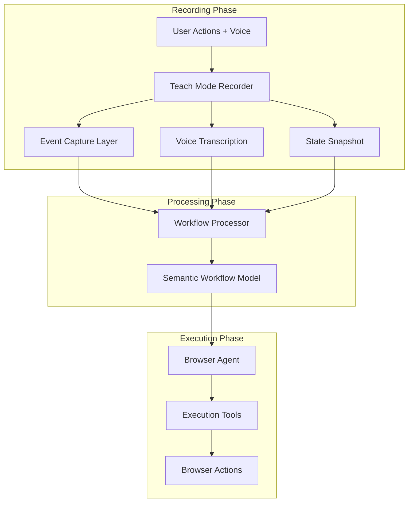

# AnalOS Teach Mode - Design Document

## Executive Summary

Teach Mode is an intelligent browser automation feature that allows users to **demonstrate** workflows through natural interactions while providing voice narration, then enables an AI agent to **learn** and **replay** these workflows autonomously. Unlike Chrome's basic recorder which captures hardcoded DOM events, Teach Mode creates semantic, adaptable workflows that can handle dynamic content and varying page states.

## Core Concept

**Teach ’ Learn ’ Execute**

1. **Teach**: User performs browser actions while narrating intent
2. **Learn**: System captures semantic understanding of the workflow
3. **Execute**: AI agent replays workflow adaptively using learned patterns

## Architecture Overview



## Key Differentiators from Chrome Recorder

| Feature | Chrome Recorder | AnalOS Teach Mode |
|---------|----------------|---------------------|
| Capture Method | Hardcoded DOM events | Semantic intent + context |
| Selector Strategy | Multiple fallbacks (CSS, ARIA, XPath) | AI-powered visual + semantic understanding |
| Narration | None | Voice narration with intent |
| Adaptability | Brittle, exact replay | Adaptive, handles dynamic content |
| Error Recovery | Fails on element changes | Self-healing with visual fallbacks |
| Scheduling | Manual trigger only | Automated scheduling support |


## Sample Use Cases

### Gmail Unsubscribe
1. Go to gmail
2. Scroll and click to `manage subscriptions`
3. Click on unsubscribe

### YC Launch to Sheets
1. Go to https://www.ycombinator.com/launches
2. Find launches from today
3. Find the founders for that company
4. Get their LinkedIn
5. Add to google sheets

## Core Architecture


### Interface Design

```typescript
interface TeachModeRecording {
  session: {
    id: string;
    startTimestamp: number;
    endTimestamp: number;
  };

  // Full voice transcript
  narration: {
    transcript: string;
  };

  // Captured events with full context
  events: CapturedEvent[];
}

interface CapturedEvent {
  id: string;
  timestamp: number;

  // Core action
  action: {
    type: 'click' | 'type' | 'navigate' | 'scroll' | 'keyDown';

    // For click/type - rich element info
    target?: {
      nodeId: number;  // AnalOS nodeId

      // Element details
      element: {
        tagName: string;
        text?: string;
        attributes: Record<string, string>;
        boundingBox: {
          x: number;
          y: number;
          width: number;
          height: number;
        };
        isVisible: boolean;
        xpath?: string;
        cssSelector?: string;
      };
    };

  };

  stateBefore: StateSnapshot;
  stateAfter: StateSnapshot;
}

interface StateSnapshot {
  timestamp: number;

  // Page info
  page: {
    url: string;
    title: string;
    tabId: string;
  };

  // AnalOS interactive snapshot
  interactiveSnapshot: AnalOSSnapshot;
  screenshot: Base64Img;
}
```

### 2. Preprocessing Output Interface

After recording, preprocess into semantic workflow:

```typescript
interface SemanticWorkflow {
  metadata: {
    goal: string; 
    description?: string;
  };

  steps: SemanticStep[];
}

interface SemanticStep {
  intent: string;
  action: {
    type: string,
    args: string, // description of action like click on search button
    identifier: string,
    validation: string,
  }

  beforeState: StateSnapshot,
  afterState: StateSnapshot,
}
```

## Missing AnalOS APIs

The following APIs need to be added to chrome.analOS to support teach mode:

### Recording Phase APIs

#### 1. Event Capture APIs
```typescript
// Start/stop recording DOM events with filtering
chrome.analOS.startEventRecording(tabId: number, options: {
  trustedOnly?: boolean;  // Filter synthetic events (default: true)
  eventTypes?: string[];  // Events to capture (default: all)
  captureTarget?: boolean; // Include target element details (default: true)
}): void;

chrome.analOS.stopEventRecording(tabId: number): RecordedEvent[];

// Real-time event stream
chrome.analOS.onEventCaptured: Event<{
  tabId: number;
  event: CapturedDOMEvent;
}>;
```

#### 2. Element Context Extraction
```typescript
// Get rich contextual information around an element
chrome.analOS.getElementContext(tabId: number, nodeId: number): {
  // Element hierarchy
  parentChain: Array<{
    tagName: string;
    text?: string;
    role?: string;
  }>;

  // Surrounding context
  context: {
    parentText?: string;
    siblingTexts?: string[];
    nearbyLabels?: string[];
    sectionLabel?: string;  // ARIA landmark or heading
  };

  // Multiple selector strategies
  selectors: {
    xpath: string;
    cssSelector: string;
    ariaSelector?: string;
    textSelector?: string;
  };
};
```

#### 3. Voice Recording APIs
```typescript
// Audio capture for narration
chrome.analOS.startAudioRecording(options?: {
  format?: 'webm' | 'wav';
  quality?: 'low' | 'medium' | 'high';
}): void;

chrome.analOS.stopAudioRecording(): Promise<Blob>;

// Optional: Built-in transcription
chrome.analOS.transcribeAudio(
  audio: Blob,
  options?: {
    language?: string;
    model?: 'local' | 'cloud';
  }
): Promise<TranscriptionResult>;
```

#### 4. Multi-Tab Context
```typescript
// Get state of all tabs (for multi-tab workflows)
chrome.analOS.getAllTabsContext(): Promise<Array<{
  id: number;
  url: string;
  title: string;
  active: boolean;
  windowId: number;
  index: number;
}>>;

// Listen for tab switches during recording
chrome.analOS.onTabSwitched: Event<{
  fromTabId: number;
  toTabId: number;
  timestamp: number;
}>;
```

### Execution Phase APIs

#### 5. Batch Operations
```typescript
// Execute multiple actions efficiently
chrome.analOS.batchExecute(tabId: number, actions: Array<{
  type: 'click' | 'type' | 'scroll' | 'clear' | 'navigate';
  params: any;
  delay?: number;  // Delay before action (ms)
}>): Promise<Array<{
  success: boolean;
  error?: string;
  timing: number;  // How long action took
}>>;
```

#### 6. Change Detection
```typescript
// Detect differences between snapshots
chrome.analOS.detectChanges(
  before: InteractiveSnapshot,
  after: InteractiveSnapshot
): {
  summary: {
    urlChanged: boolean;
    titleChanged: boolean;
    elementsAdded: number;
    elementsRemoved: number;
    elementsModified: number;
  };

  details: {
    newNodeIds: number[];
    removedNodeIds: number[];
    modifiedNodeIds: number[];
    newElements: Array<{
      nodeId: number;
      description: string;
    }>;
  };
};
```

#### 7. Visual Element Search
```typescript
// Find elements by visual description (for fallback)
chrome.analOS.findElementByDescription(
  tabId: number,
  description: string,
  options?: {
    searchArea?: 'viewport' | 'full';
    similarity?: number;  // 0-1 threshold
  }
): Promise<{
  found: boolean;
  nodeId?: number;
  confidence: number;
  alternativesNodeIds?: number[];  // Other potential matches
}>;
```

### Enhanced Existing APIs

#### 8. Enhanced Screenshot API
```typescript
// Ensure screenshot includes overlays
chrome.analOS.captureScreenshot(
  tabId: number,
  options: {
    size?: number;
    showOverlays?: boolean;  // Show nodeId labels
    highlightInteractive?: boolean;  // Highlight clickable/typeable
    format?: 'png' | 'jpeg' | 'webp';
  }
): Promise<string>;  // base64
```

#### 9. Enhanced Interactive Snapshot
The existing `getInteractiveSnapshot` should include:
- Element hierarchy/parent chain
- ARIA roles and landmarks
- Form field types and states
- Shadow DOM content
- Iframe detection

### Utility APIs

#### 10. Workflow Storage
```typescript
// Store/retrieve taught workflows
chrome.analOS.storage.workflows.save(
  workflow: SemanticWorkflow
): Promise<string>;  // workflow ID

chrome.analOS.storage.workflows.get(
  id: string
): Promise<SemanticWorkflow>;

chrome.analOS.storage.workflows.list(): Promise<Array<{
  id: string;
  name: string;
  createdAt: number;
}>>;
```

## Integration with NewAgent

The existing NewAgent architecture can execute taught workflows by:

1. **Adding taught workflow execution mode**:
   - Detect `executionMode: 'taught'` in metadata
   - Load SemanticWorkflow from storage or parameter
   - Execute steps with validation and fallback strategies

2. **Leveraging existing tools**:
   - Use existing click/type/navigate tools for primary actions
   - Fall back to moondream_visual_click/type when elements change
   - Use extract tool for data extraction steps

3. **Enhanced error handling**:
   - Detect when demonstrated elements don't exist
   - Automatically switch to visual search
   - Report which steps failed vs succeeded

## Conclusion

AnalOS Teach Mode represents a paradigm shift from brittle DOM-based recording to intelligent, semantic workflow automation. By combining voice narration, visual understanding, and adaptive execution, it enables users to create robust automations through natural demonstration rather than programming.

The phased implementation approach ensures we can deliver value quickly while building toward the complete vision. The architecture leverages existing AnalOS infrastructure while adding the key innovations needed for true learn-by-demonstration automation.
